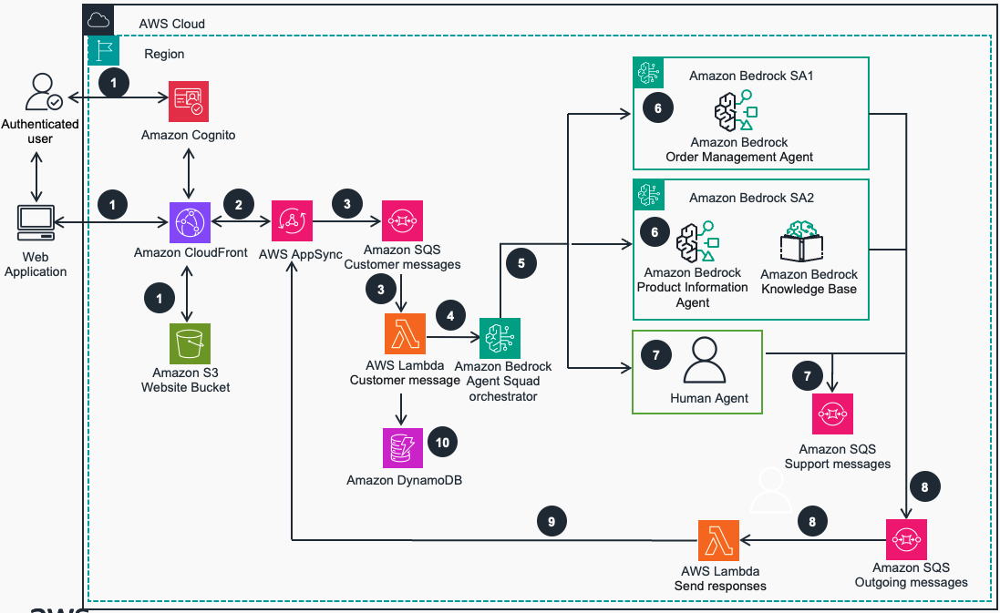
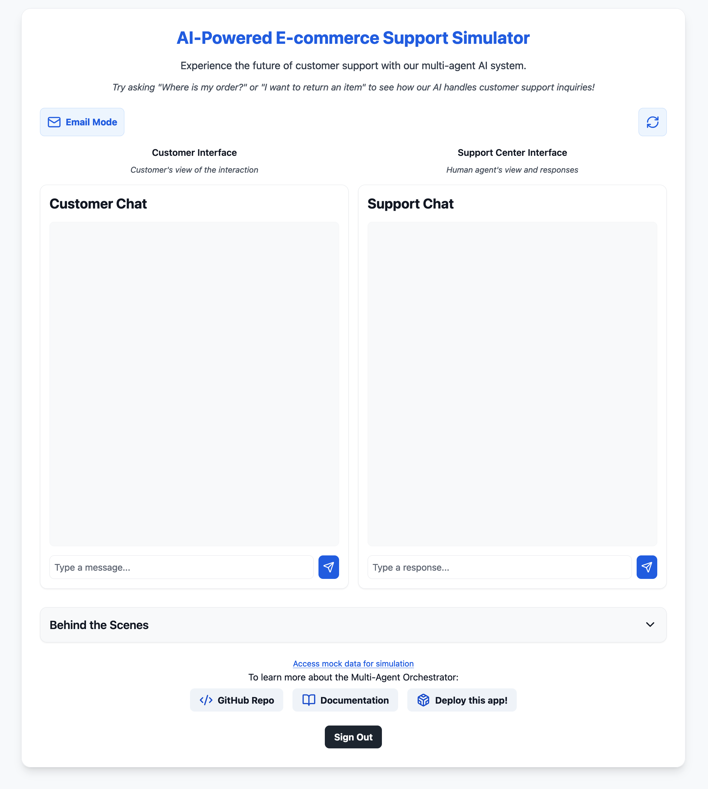
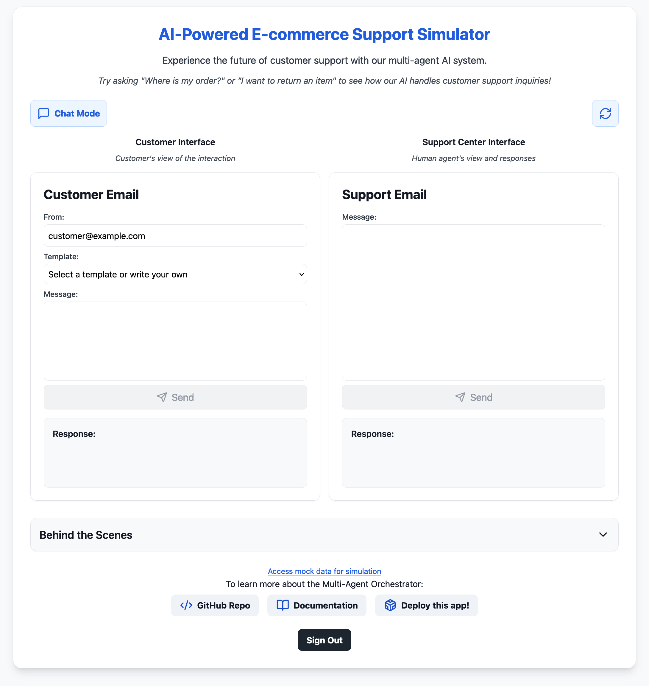
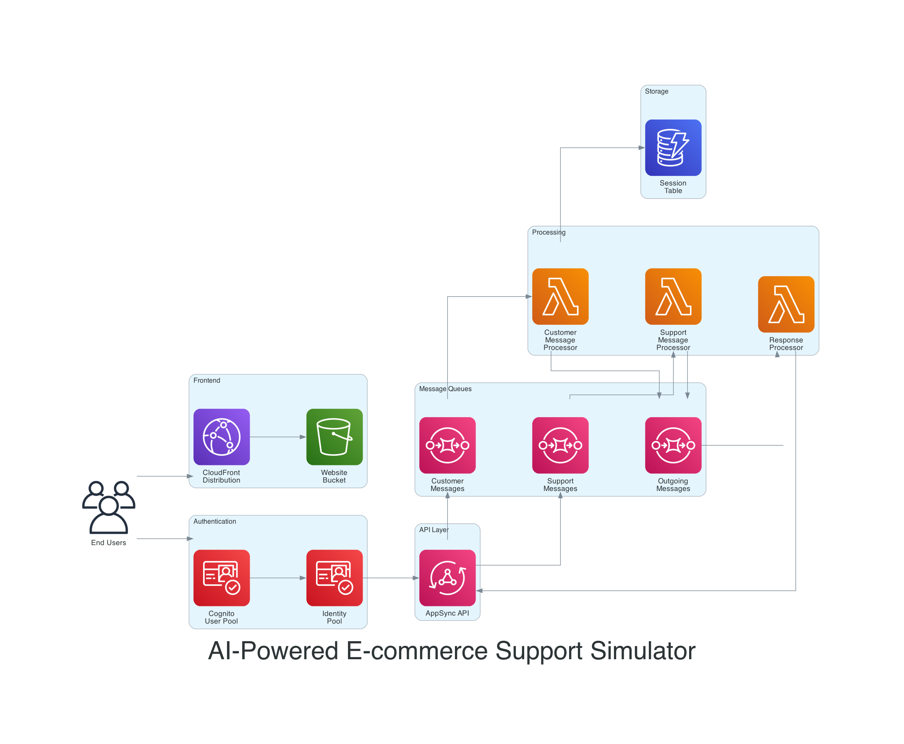

# Guidance for Multi-Agent Orchestration with Agent-Squad on AWS


A demonstration of how AI agents and human support can work together in an e-commerce customer service environment. This project showcases intelligent query routing, multi-agent collaboration, and seamless human integration for complex support scenarios.

## 🎯 Key Features

- Multi-agent AI orchestration with specialized models
- Real-time and asynchronous communication modes
- Seamless integration with human support workflow
- Tool-augmented AI interactions
- Production-ready AWS architecture
- Mock data for realistic scenarios

## Architecture Design


1. The user accesses the web application through Amazon CloudFront, which delivers content from the Amazon S3 Website bucket, while Amazon Cognito handles authentication and provides temporary credentials via Identity Pool.

2. The authenticated user sends messages through the web UI, which communicates with AWS AppSync GraphQL API to process queries, mutations, and subscriptions for real-time communication.

3. AWS AppSync routes customer messages to the Amazon SQS Customer Messages Queue, which triggers the AWS Lambda Customer Message Handler function to process incoming customer inquiries.

4. AWS Lambda Customer Messages initializes the Agent Squad orchestrator, which uses Amazon Bedrock Classifier to analyze the message content and determine which specialized AI agent should handle the request.

5. Based on the classification, the message is routed to one of three agents: the Order Management Agent (using Claude 3 Sonnet), the Product Information Agent (using Claude 3 Haiku), or the Human Agent for complex cases requiring human intervention.

6. The Order Management Agent handles order-related inquiries using tools for order lookup, shipment tracking, and return processing, while the Product Information Agent retrieves product details from the Amazon Bedrock Knowledge Base connected to OpenSearch Serverless.

7. When complex inquiries are routed to the Human Agent, it performs two simultaneous actions: first, it immediately responds to the customer with a notification message confirming that their request has been received and will be handled by a human support representative; second, it sends the customer's original message to the Amazon SQS Support Messages Queue where human support staff can retrieve and process the request asynchronously.

8. Agent responses are sent to the Amazon SQS Outgoing Messages Queue, which triggers the AWS Lambda Send Response Handler to process and format the responses.

9. The Send Response Lambda sends the formatted responses back to AWS AppSync, which delivers them to the web UI through GraphQL subscriptions for real-time updates to the customer interface.

10. Throughout this process, Amazon DynamoDB stores conversation history and session data, while AWS IAM roles and policies ensure secure access to all services and resources.


## 💻 Interface & Communication Modes

The system provides two distinct interaction modes to accommodate different support scenarios and user preferences:

### Real-Time Chat Interface


The chat interface provides immediate, conversational support:
- Instant messaging-style communication
- Live message streaming
- Real-time agent responses
- Automatic message routing
- Separate chat windows for customer and support perspectives

### Email-Style Communication


The email interface supports structured, asynchronous communication:
- Email composition interfaces for both customer and support
- Pre-defined templates for common scenarios
- Response viewing areas for both parties
- Asynchronous message handling
- Template support for standardized responses

### Key Features Across Both Modes

Both interfaces demonstrate:
1. **AI Capabilities**: Natural language understanding, context retention, appropriate tool usage
2. **Human Integration**: Seamless handoffs, verification workflows, complex case handling
3. **Tool Usage**: Order lookup, shipment tracking, return processing
4. **System Intelligence**: Query classification, routing decisions, escalation handling

## 🏗️ System Architecture


The system employs multiple specialized AI agents, each designed for specific tasks:

#### 1. Order Management Agent
- **Implementation**: `BedrockLLMAgent`
- **Model**: Anthropic Claude 3 Sonnet (`anthropic.claude-3-sonnet-20240229-v1:0`)
- **Purpose**: Handles all order-related inquiries and management tasks
- **Tools**:
  - `orderlookup`:
    - Retrieves order details from database
    - Input: `orderId` (string)
    - Returns: Complete order information including status, items, and pricing
  - `shipmenttracker`:
    - Provides real-time shipping status updates
    - Input: `orderId` (string)
    - Returns: Current shipment status, location, and estimated delivery
  - `returnprocessor`:
    - Manages return request workflows
    - Input: `orderId` (string)
    - Returns: Return authorization and instructions


#### 2. Product Information Agent
- **Implementation**: `BedrockLLMAgent`
- **Model**: Anthropic Claude 3 Haiku (`anthropic.claude-3-haiku-20240307-v1:0`)
- **Purpose**: Provides comprehensive product information and specifications
- **Integration**:
  - Connected to `AmazonKnowledgeBasesRetriever` for product data
  - Knowledge Base ID configuration required
- **Key Features**:
  - Real-time product database access
  - Specification lookups
  - Availability checking
  - Compatibility information


#### 3. Human Agent
- **Implementation**: Custom `HumanAgent` class extending base `Agent`
- **Purpose**: Handles complex cases requiring human intervention
- **Integration**:
  - AWS SQS integration for message queuing
  - Requires queue URL configuration
- **Features**:
  - Asynchronous message handling
  - Bi-directional communication support
  - Customer and support message routing


### AWS Infrastructure



The system is built on AWS with the following key components:

- **Frontend**: React-based web application served via CloudFront
- **API Layer**: AppSync GraphQL API
- **Message Routing**: SQS queues for reliable message delivery
- **Processing**: Lambda functions for message handling
- **Storage**:
  - DynamoDB for conversation history
  - S3 for static assets
- **Authentication**: Cognito user pools and identity pools
- **Monitoring**: Built-in logging and debugging capabilities

### Mock Data
The system includes a comprehensive `mock_data.json` file that provides sample order information

### Cost estimate

| AWS Service | Dimensions | Cost [USD] |
|-------------|------------|------------|
| Amazon CloudFront | 100GB data transfer, 1M HTTP requests per month | $9.00 |
| Amazon S3 | 20GB storage for website assets, 2M requests per month | $1.50 |
| Amazon Cognito | 10,000 monthly active users (MAUs) | $55.00 |
| AWS AppSync | 5M queries and 1M real-time subscriptions per month | $45.00 |
| Amazon SQS | 3M messages across all queues (Customer, Support, Outgoing) | $3.60 |
| AWS Lambda | 3 functions (Customer Message Handler, Agent Squad Orchestrator, Send Response Handler), 3M invocations, avg 256MB memory, 500ms duration | $25.00 |
| Amazon Bedrock (Claude 3.7 Sonnet) | Order Management Agent: 50,000 requests/month, avg 4,000 tokens per request (input+output) | $300.00 |
| Amazon Bedrock (Claude 3 Haiku) | Product Information Agent: 75,000 requests/month, avg 2,000 tokens per request (input+output) | $112.50 |
| Amazon Bedrock Knowledge Base | 5GB data indexed, 50,000 queries per month | $125.00 |
| Amazon DynamoDB | 20GB storage, 10M read request units, 5M write request units | $35.00 |
| AWS IAM | Identity and access management policies and roles | $0.00 |
| Total Monthly Cost | | $711.60 |

## 📋 Deployment

Before deploying the demo web app, ensure you have the following:

1. An AWS account with appropriate permissions
2. AWS CLI installed and configured with your credentials
3. Node.js and npm installed on your local machine
4. AWS CDK CLI installed (`npm install -g aws-cdk`)

## 🚀 Deployment Steps

Follow these steps to deploy the demo chat web application:

1. **Clone the Repository**:
   ```bash
   git clone https://github.com/aws-solutions-library-samples/guidance-for-multi-agent-orchestration-agent-squad-on-aws
   cd guidance-for-multi-agent-orchestration-agent-squad-on-aws
   ```

2. **Install Dependencies**:
   ```bash
   npm install
   ```

3. **Bootstrap AWS CDK**:
   ```bash
   cdk bootstrap
   ```

4. **Deploy the Application**:
   ```bash
   cdk deploy
   ```

5. **Create a user in Amazon Cognito user pool**:
   ```bash
   aws cognito-idp admin-create-user \
       --user-pool-id your-region_xxxxxxx  \
       --username your@email.com \
       --user-attributes Name=email,Value=your@email.com \
       --temporary-password "MyChallengingPassword" \
       --message-action SUPPRESS \
       --region your-region
   ```

## 🌐 Accessing the Demo Web App

Once deployment is complete:
1. Open the URL provided in the CDK outputs in your web browser
2. Log in with the created credentials

## 🧹 Cleaning Up

To avoid incurring unnecessary AWS charges:
```bash
cdk destroy
```

## 🔧 Troubleshooting

If you encounter issues during deployment:

1. Ensure your AWS credentials are correctly configured
2. Check that you have the necessary permissions in your AWS account
3. Verify that all dependencies are correctly installed
4. Review the AWS CloudFormation console for detailed error messages if the deployment fails

## ⚠️ Disclaimer

This demo application is intended solely for demonstration purposes. It is not designed for handling, storing, or processing any kind of Personally Identifiable Information (PII) or personal data. Users are strongly advised not to enter, upload, or use any PII or personal data within this application. Any use of PII or personal data is at the user's own risk and the developers of this application shall not be held responsible for any data breaches, misuse, or any other related issues. Please ensure that all data used in this demo is non-sensitive and anonymized.

For production usage, it is crucial to implement proper security measures to protect PII and personal data. This includes obtaining proper permissions from users, utilizing encryption for data both in transit and at rest, and adhering to industry standards and regulations to maximize security. Failure to do so may result in data breaches and other serious security issues.
